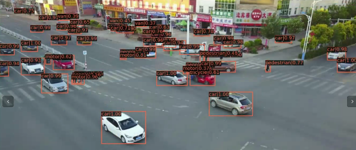
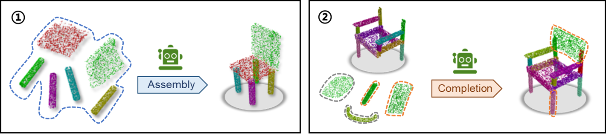
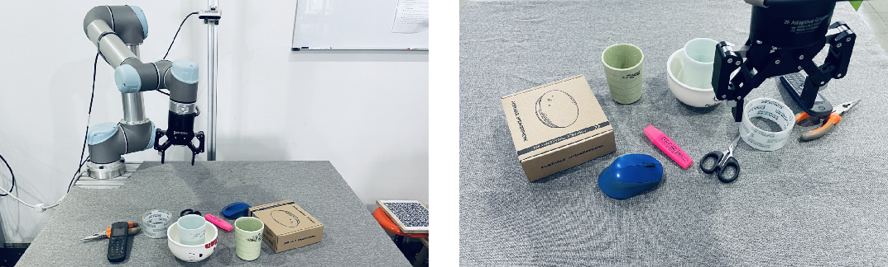
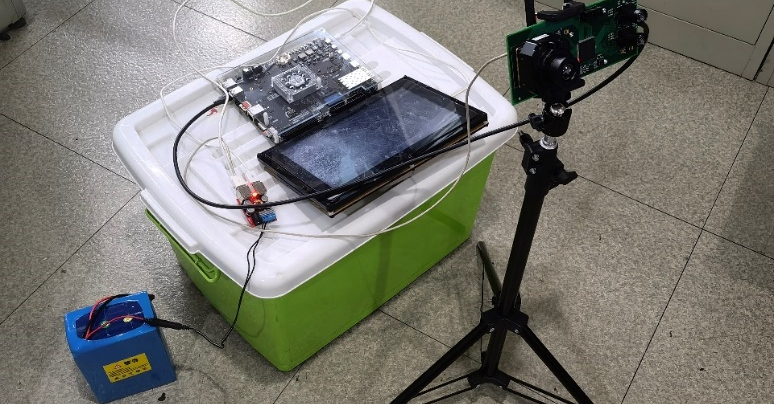
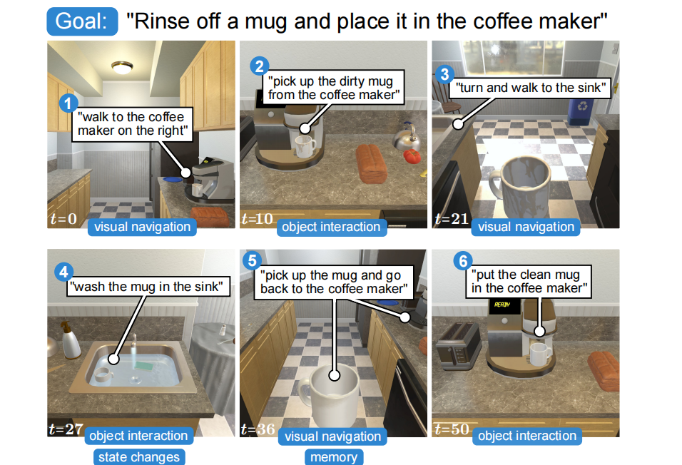
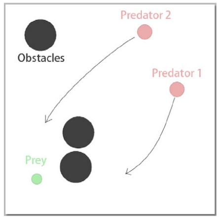
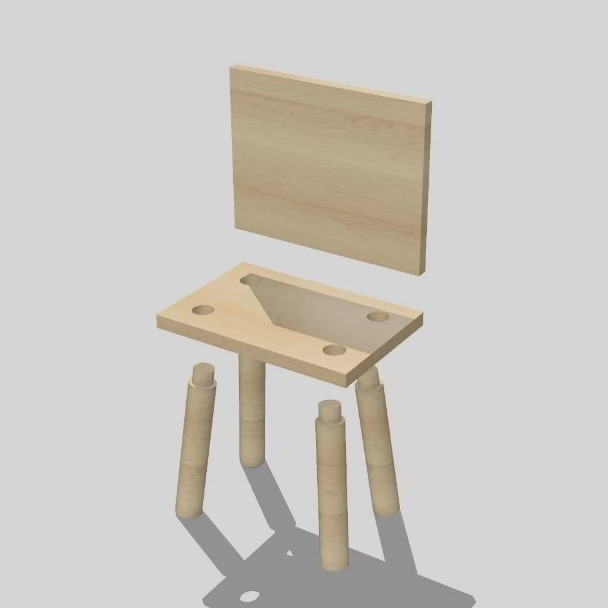



* 小目标视频检测和小样本迁移学习  
  
* 三维装配生成与补全:给定一系列候选部件，将其组装成完整的装配体，或将半成品补装完整。  
  
* 从机器人物理交互中学习结构化表征，提升机器人技能学习的样本效率和泛化性能。  
  
* 目标检测模型的量化、剪枝压缩与卷积神经网络的FPGA部署。  
  
* 运用可解释性模型进行高效准确的指令遵循，输入语言指令和图片特征来引导机器人长序列动作生成。  
  
* 部分观测条件下，多智能体在合作任务上的规划与决策控制。  
  
* 三维重建、物体位姿检测、虚实融合。  
  

